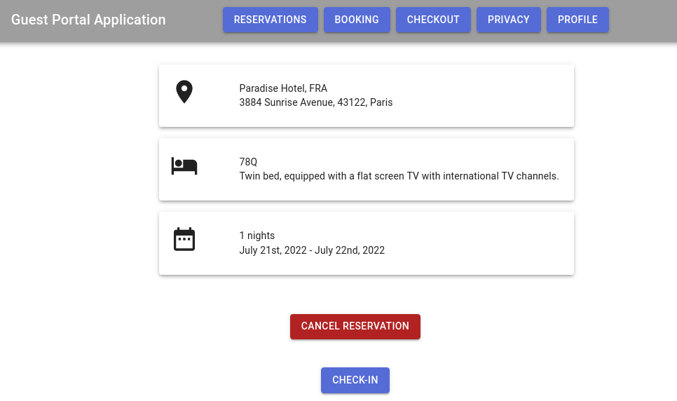

 <h1>User documentation</h1> 

This document serves as a general instruction manual for the user. Let's take a look at the major hotel operations executed in our applications from their point of view to see the apps work.

 <h2><ins>Guest Portal Application</ins></h2> 

First, we will take a look at the application aimed at the guests.

### <ins>Overview</ins>

Let's take a look at the index page first to familiarize ourselves with the ubiquitous components. 

We find the notification icon on the left of the navigation bar - as this component is identical to the one used by the PMS, we detail this in [the shared functionalities reference section](#notifications).

The authentication button is placed on the right side of the navigation bar. The button performs the login or logout operation based on the current status of the user's authentication status. More on this functionality in [the Login section](#login).

The body of the page contains the buttons allowing the user to operate with the hotel reservations and their profile. We'll take a look at each of these operations later in this section.

The buttom of the page consists of the application footer, which displays some basic information about the project. This component is not interactive.

### <ins>Login in GPA</ins>

Detailed in [the shared functionalities reference section](#login).

### <ins>Booking</ins>

Clicking on the `Book a room` button on the index page begins the process of making a reservation. This operation is separated into three sequential subpages.

The first stop is to select the room for which the reservation will be made. The user can only select one room at a time. Below these options are the date picker elements, which let the user select their check-in and check-out dates. Note that the earliest date that can be chosen for the check-in date is the current day, while the earliest for check-out is the day after the check-in date. If the components report an error, please select dates which these specifications. When the user is satisfied with their choices, they click the `Proceed` button.

  

The second subpage is one which checks if all the personal information fields required for future check-in are present in the guest's profile saved in the Pod (we specify here and for future reference that this profile is saved under `{USER_POD}/profile/card#me`). If some field is missing, the application provides a way to fill it in. The `Proceed` button gets enabled when all fields have corresponding values.

The third subpage is the one informing the user about the successful operation. At this point we saved a reservation object with the details into the guest's Solid Pod. This reservation will temporarily be in the `REQUESTED` state - when the hotel responds and confirms the reservation, it gets changed to `CONFIRMED` and the booking is completed.

### <ins>List reservation and reservation detail</ins>

Clicking `List reservations` on the index page takes the user to the reservations page, displaying all items retrieved from their Pod. Reservations are categorized by their state. Each item is clickable and clicking on them takes the guest to the corresponding reservation details page.

The page presents a bit more detailed information about the stay and, more importantly, features buttons enabling further actions for the given reservation. 

#### <ins>Cancellation</ins>

If it is in `CONFIRMED` state, a `Cancel reservation` button will be revealed. The user may click on this button if they want to cancel their booking. After clicking, a popup prompt will appear to confirm that the user indeed wishes to execute the cancellation, which the guest may perform after marking the confirmation checkbox displayed. The cancellation request is then sent to the hotel and after reply, the reservation is moved into state `CANCELLED`.

#### <ins>Check-in</ins>

The other action which can triggered from this page is the check-in operation. The appropriate button is presented when the state is `CONFIRMED` and we are after the expected check-in time. Clicking on this takes the user to the required fields subpage, where they can fill in personal information necessary for check-in (based on the same principle as in [booking](#booking)). When all required fields are filled in, the `Proceed` button is enabled and the user may click it. If done, a check-in request is sent to the hotel, which creates their local hotel profile from the required fields filled in. After its reply, the reservation state is moved to `ACTIVE`.

It is in this state where profile synchronization with the profile created at the hotel's side is also enabled. See more about this in the [profile synchronization](#profile-synchronization) section.

### <ins>Check-out</ins>

Another key operation launchable from the index page is check-out. Note, that this button is revealed only if there's an appropriate reservation, i.e. with a state set to `ACTIVE`. If the user sees this button and clicks on it, they are taken to the simple reservation selector page. Here they can pick the item for which they wish to perform the check-out in case there are multiple simultaneous ones present. After choosing and clicking on the `Proceed` button, the request is sent to the hotel and after reply, the state is set to `PAST`.

With this operation, the profile synchronization gets disabled, as the hotel removes their local copy of the profile. There is no synchronization with the data protection profile created during this operation.

### <ins>Privacy dashboard</ins>

The privacy dashboard provides an overview of the personal information fields used by various hotels at the time. It can be reached from the index page by clicking the `Privacy dashboard` button.

The user can see here what fields are currently used, the reason for such usage and the expiry date when these values will be no longer needed. These are grouped by the hotel the user made reservations at. Apart from this information, each item also contains a `Delete` button, which becomes enabled when the application deems the privacy token as no longer required. 

Note that for most cases, the tokens get removed by the hotel's initiative automatically, when the reservation moves from one state to another. Exception to this is the occassion when the reservation does not follow the usual lifecycle or when the data protection profile has expired. There is no automatical deletion scheduled for such cases, because of which the user may request their deletion manually by clicking on the corresponding `Delete` button. The request is then sent to the hotel and is deleted on that side as well as the side of the guest after positive reply.

### <ins>Profile editor</ins>

Takes the user to a page incorporating the Solid Profile Editor. For more information, please see the dedicated section.

### <ins>Reservation pairing</ins>

The pairing page of the GPA is hidden from the user, as this operation is triggered by an external factor. The option to do this appears in an occassion when the guest was [checked in offline](#offline-check-in).

After the guest scanned in the QR code presented by the hotel employee, they get taken to this hidden page in GPA. Here, they are instructed to [log-in to their Solid Pod](#login) or create one if they don't have one set up yet. If the log-in was successful, a notice is sent to the hotel. After the hotel's reply, the guest is informed that the pairing was performed and the reservation gets updated in their Solid Pod. Optionally, the guest may click on the function to populate their Solid profile with the personal information yielded during the offline check-in.

 <h2><ins>Property Management System</ins></h2> 

Now, let us take a look at the application used by the hotel.

### <ins>Overview</ins>

Let's take a look at the index page first to familiarize ourselves with the ubiquitous components. 

We find the notification icon on the left of the navigation bar - as this component is identical to the one used by the GPA, we detail this in [the shared functionalities reference section](#notifications).

The authentication button is placed on the right side of the navigation bar. The button performs the login or logout operation based on the current status of the user's authentication status. More on this functionality in [the Login section](#login).

The buttom of the page consists of the application footer, which displays some basic information about the project. This component is not interactive.

### <ins>Login in PMS</ins>

Detailed in [the shared functionalities reference section](#login).

### <ins>Room management</ins>

Clicking the corresponding button brings the hotel employee to the room overview page. Users can see existing items while also having the possibility to create, edit and delete room definitions.

Creating and editing a room is a straightforward operation, which can be achieved by clicking `Create room` at the bottom of the page or `Edit` for the corresponding item. In both cases a popup dialog appears allowing the user to modify the text values of the name and the description of the room. The description may be empty if the user so wishes. Changes are saved by clicking the `Save` button.

A little more problematic is the deletion of a room definition. As it does not make sense to have reservations for a room that's gone from the system, deletion triggers the cancellation of all `CONFIRMED` (future) reservations referencing this room. `ACTIVE` and `PAST` reservations are left unchanged (the hotel will wait the current guest to leave and start e.g. renovation of the room only after). **This action is not reversible.**

### <ins>Booking</ins>

PMS booking is largely identical to the one [described for the GPA](#booking) with the exception of the required fields subpage. Booking in this application consists of the reservation properties subpage, by the resolution of which the reservation is created.

The goal of this booking is to be the precursor of [offline check-in](#offline-check-in). We mean this operation to be executed when a person walks into the hotel and requests a reservation for some future date.

### <ins>Reservations</ins>

This page displays all reservations currently present in the hotel Pod. Besides a few lines of information common for all items, their outlook depends on their current state.

`CONFIRMED` items have an attached cancellation and offline check-in button, but link to no further pages. Clicking on an `ACTIVE` reservation takes the hotel employee to the hotel profile page. In addition, unpaired `ACTIVE` items also have a QR button displayed, which displays the QR code meant for the pairing of the reservation. Clicking on `PAST` reservations takes the user to the data protection page if still avaiable.

Let us detail each of these pages or functionalities separately.

### <ins>Cancellation</ins>

Similarly to the GPA, the cancellation button triggers a popup asking the hotel employee to confirm their intention. If the answer is positive, the guest is informed about the change as well. **This action is not reversible.**

### <ins>Offline check-in</ins>

The functionality starts by asking the user to specify the nationality of the guest as this will drive what personal information fields are required.

The user is then taken to the required fields page, which the hotel employee fills out with the details of the guest. When all fields have values, the `Proceed` button gets enabled and the user is free to move forward.

The next subpage displays the QR code, which can be used to pair the reservation to a not yet known Solid Pod of the guest. Scanning the QR code takes the user to the [pairing page in the GPA](#reservation-pairing). The hotel employee is free to continue anytime as the pairing will happen in the background.

The last subpage is a success notice indicating that everything went well with the offline check-in.

### <ins>Hotel profile page</ins>

Features the guest profile where the field values are editable, but not deletable. Any changes made to the profile are [automatically propagated to the guest](#profile-synchronization).

Besides the profile, this page also contains the following two buttons.

#### <ins>Print registration card</ins>

Creates a printable view which feaures mainly the guest profile besides some other information and placeholders for signatures. Offers to print the document out according to the system's printer settings.

This functionality is meant to be used after offline check-in so the guest can verify the correctness of the data and the hotel can create a paper trail of the guest's approval.

#### <ins>Export authorities report</ins>

Clicking this button generates a CSV file containing the guest's profile and triggers a download prompt for the hotel employee. This file is then submitted to the authorities for legal purposes, but this happens outside the frames of this application.

### <ins>Data protection profile page</ins>

A simple page displaying the data protection profile of a guest in a read-only format. The field values are not editable or deletable as there is no need to keep this data updated.

### <ins>Privacy dashboard</ins>

The privacy dashboard is similar in structure to the [page described in the GPA](#privacy-dashboard). The difference here is that the tokens are grouped by reservation, i.e. the fields a specific reservation currently uses. The PMS version of this page also doesn't contain a `Delete` button, as hotel employees do not have a reason to request deletion manually.

 <h2><ins>Solid Profile Editor</ins></h2> 

The Solid Profile Editor is a small, simple application consisting of two pages: [the login page](#login) common for all our applications and the profile page, which displays the personal information fields of the guest fetched from their profile. The fields are both editable and deletable.

 <h2><ins>Shared functionalities reference</ins></h2> 

We detail the operations here which are common for two or more applications.

### <ins>Login</ins>

As the first operation, the user must log in to their Solid Pod, as only a very few functionalities are permitted while being unauthenticated. To achieve this, click on the Login button found in the navigation bar.

This takes the user to the login page, where they have the option to input a custom Solid provider, or choose from the built-in ones. These Solid providers are the places the user's Pod is located. The input field for custom providers verifies the text entered, so make sure to input a valid URL link.

After selecting a provider, the GPA redirects to the provider's page to authenticate the user. Please input your login details here. If the operation is successful, the user is returned to either the login or the index page.

### <ins>Notifications</ins>

The notification component displays the number of notifications the application currently recognizes. Clicking on the icon brings up the list of such items on the left side of the screen. These notification items are clickable and they may perform actions based on the type of the notification. This action is indicated by the notification message. The type, as well as the time the item the item was constructed, is displayed for each item. They are also deletable by clicking on the `Clear` button of the respective notification. Clicking anywhere else on the screen closes the displayed list.

  

### <ins>Profile synchronization</ins>

For an `ACTIVE` reservation, a local copy of the guest's profile is created in the hotel Pod. In order to keep the information up-to-date, we provide logic synchronizing these two instances of the same profile.

The synchronization is a two-way operation:

#### <ins>Incoming request</ins>

The user receives a notification that the couterparty applied some value changes in their profile on side of the counterparty. Clicking on the notification brings up a panel in the bottom right corner detailing what these changes entail and asking for the user's confirmation whether they want to propagate these changes to their copy of the profile.

The changes can be approved on a per item basis.

#### <ins>Outgoing request</ins>

While there is at least one `ACTIVE` reservation in effect for the user, we have a functionality put in place to monitor the guest's profile in case any changes are performed on it. Note that these changes do not have to be necessarily made through our application.

When such an event occurs, the applications prepare an approval dialog in the bottom right corner. Here we differentiate slightly different behaviour for the GPA and the PMS:
1. **GPA** - The guest is presented with a series of approval dialogs for each hotel currently in `ACTIVE` relation with the user. The user may choose which field changes to propagate to which hotels. They can do so by selecting the appropriate choice in the dialog and clicking the `Send` button.
2. **PMS** - The situation is simpler for the case of the hotel. We do not grant the hotel employee the right to filter what changes are to be propagated or if even to let the user know anything at all. The application displays an informational dialog about the changes and sends the report immediately to the guest. The user can close the dialog by acknowledging with the `OK` button.